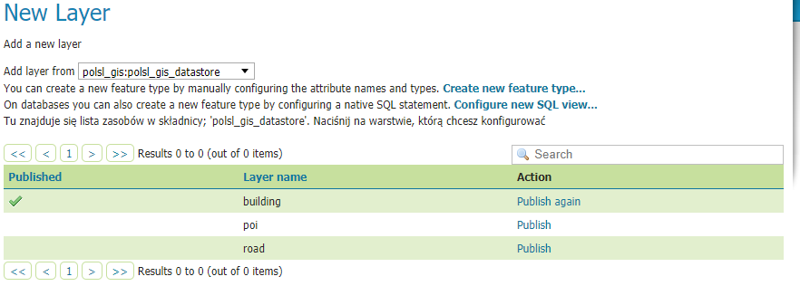

## Instalacja PostgreSQL i PostGIS

Pierwszym krokiem do uruchomienia relacyjnej bazy danych PostgreSQL z dodatkiem dla danych przestrzennych PostGIS jest
udanie się pod [ten link](https://www.postgresql.org/download/). Należy pobrać najnowszą wersję pod nasz system
operacyjny. 

Bazę danych należy zainstalować z domyślnymi ustawieniami. Ważne jest to, aby zapamiętać jakie hasło ustawiło się dla 
konta administracyjnego `postgres` podczas procesu instalacji, ponieważ nie ma opcji przypomnienia hasła i nie będzie
możliwość połączenia się z bazą danych.

Po zakończeniu instalacji, powinno się pojawić okienko dialogowe z pytaniem `Czy aplikacja powinna akeceptować zapytania
przychodzące z sieci`, oczywiście się zgadzamy. Warto również zaznaczyć, aby po instalacji został uruchomiony `StackBuilder`.
Jeśli przeoczymy ten etap to nic stracone, wystarczy uruchomić aplikację `StackBuilder`, która została zainstalowana z naszą 
instancją PostgreSQL.

Aplikacja `StackBuilder` posłóży do rozszerzenia PostgreSQL o dodatek PostGIS. Klikamy dalej, uprzednio wybierając zainstalowaną bazę danych,

 
aż dojdziemy do okna z woborem aplikacji do zainstalowania, pod zakładką `Spatial Extensions` znajduję się `PostGIS`, zazanaczamy i kontynujemy instalację
z domyślnymi parametrami.

## Geoserver
Najpierw upewniamy się, że mamy zainstalowane środowisko uruchomieniowe języka Java (JRE lub JDK), możemy je pobrać np: z 
[Oracle JDK](https://www.oracle.com/technetwork/java/javase/downloads/index.html). Geoserver działa poprawnie począwszy od Java 8 przez 11. 
Na wersji 13 nie zostały przeprowadzony wystarczające testy. Jeśli JDK lub JRE od firmy Oracle z jakiś przyczyn nie może być zainstalowane, Geoserver działa
adekwatnie na OpenJDK, które można zdobyć np: [tutaj](https://adoptopenjdk.net/).

### Zmienna środowiskowa JAVA_HOME

Po zainstalowaniu JDK/JRE ważne jest, aby ustawić zmienną środowiskową `JAVA_HOME`:
1. Przchodzimy do `Panel Sterowania` -> `System` -> `Zaawansowane ustawienia systemu` -> `Zmienne środowiskowe`
2. Pod `Zmienne systemowe` klikamy  `Nowa...`
3. Dla `Nazwa zmiennej` wpisujemy `JAVA_HOME`. Dla `Wartość zmiennej` wpisujemy ścieżkę do głównego folderu JDK/JRE np:
`C:\Program Files\Java\jdk1.8.0_40`.
4. Klikamy `Ok` dokładnie trzy razy.

### Uruchamianie Geoservera

Geoserver jest narzędziem w języku Java, które służy do udostępnienia niemalże wszystkich ogólnodostępnych formatów zdolnych 
do przechowywania danych przestrzennym. Ze [strony](http://geoserver.org/release/stable/) pobieramy `Platform independent Binary` 
i wypakowujemy zawartość. Otwieramy wypakowany folder i następnie whodzimy do folderu `bin`. Zależnie od systemu operacyjnego uruchamiamy 
`startup.bat` (Windows) lub `startup.sh` (Unix) i czekamy aż się uruchomi. Zamykamy adekwatnie przez uruchomienie `shutdown.bat`
lub `shutdown.sh`.  

Jeśli inicjalizacja aplikacji Geoserver zakończy się sukcesem to w dowolnej przeglądarce internetowej wchodzimy w 
[http://localhost:8080/geoserver](http://localhost:8080/geoserver) i logujemy się domyślnym użytkownikiem `admin` i hasłem `geoserver`.

## Instalacja PostgreSQL i PostGIS Docker

Pobieramy obraz PostgreSQL z PostGIS  

`docker pull kartoza/postgis` (domyślny użytkownik: `docker` z hasłem `docker`)

Pobieramy obraz Geoserver  

`docker pull kartoza/geoserver` (domyślny użytkownik: `admin` z hasłem `geoserver`)

Uruchamiamy bazę danych i geoserver  

`docker run --name "postgis" -d -t kartoza/postgis`  
`docker run --name "geoserver" --link postgis:postgis -p 8080:8080 -d -t kartoza/geoserver`

Dodatkowe informacje znajdują się w dokumentacji obrazu [Geoserver](https://hub.docker.com/r/kartoza/geoserver/) oraz 
[PostGIS](https://hub.docker.com/r/kartoza/postgis)

## Praca z Geoserverem

Po uruchomienie Geoservera udajemy się pod [http://localhost:8080/geoserver](http://localhost:8080/geoserver), gdzie znajduję się
panel administracyjny. Logujemy się standardowo na użytkownika `admin` o haśle `geoserver`.

### Przestrzeń robocza

Pracę z Geoserverem warto zacząć od stworzenia przestrzeni roboczej (Workspace), do której będziemy przypisywać wszystkie 
przez nas wystawaiane operacje.

1. Wybieramy `Worskpaces` z menu.
2. Następnie używamy przycisku `Add new workspace`.

   

3. Wpisujemy dowolną odpowiadającą nam nazwę w pole `Name`.
4. W pole `Namespace URI` wpisujemy dowolny adres, który może zostać skojarzony z naszym zasobem. 
Nie musi to być istniejący adres.
5. Opcjonalnie można zaznaczyć opcje `Default Workspace`, aby nasz obszar roboczy stał się domyślny.
6. Zatwierdzamy klikając w przycisk `Wyślij`.
7. Jeśli się uda, otrzymamy taki wynik:  

    

### Połączenie Geoservera z bazą danych PostGIS

W celu połączenie bazy danych PostgreSQL z rozszerzeniem PostGIS z Geoserverem, należy dodać tzw. przechowalnie (store).

1. Wybieramy `Stores` z menu.
2. Następnie używamy przycisku `Add new Store`.
3. Wybieramy opcję PostGIS NG.

   

4. Ustawiamy informacje o źrodle danych, należy pamiętać, aby wybrać uprzednio utworzony obszar roboczy:

   

5. Ustawiamy połączenie do utworzonej wcześniej bazy danych:

   

6. Pozostałe ustawienia pozostawiamy na wartościach domyślnych.
7. Zatwierdzamy przez przycisk `Save`.
8. Jeśli wszystko zakończy się powodzeniem otrzymamy taki widok, gdzie `LayerName` jest równoznaczny z nazwą tabeli.

   

### Publikacja zasobów

W celu publikacji zawartości bazy danych należy wystawić warstwę:

1. Wybieramy `Warstwy` z menu.
2. Następnie używamy przycisku `Dodaj nowy zasób`.
3. Z listy rozwijanej wybieramy uprzednio utworzoną przechowlanie (store).
4. Klikamy w `Publish` przy wybranej przez nas nazwie tabeli.

    
    
5. Formularz `Edit Layer` zawiera podstawowe informacje o naszym publikowanyn zasobie. Uzupełniamy tak jak na przykładzie, najważniejsze 
jest pole `Nazwa`, ponieważ będzie je później traktować jako identyfikator. Pola `Tytuł` oraz `Abstract` są dowolne:

    

6. Przechodzimy do forumularza `Granice` i klikamy kolejno `Obliczyć na podstawie danych`, jeśli tabela posiada dane lub 
`Compute from SRS bounds`, jeśli takowych danych nie ma. Następnie klikamy w `Oblicz na podstawie natywnych granic`:
    
     
    
7. Wracamy na górę strony i klikamy w zakładkę `Publishing` i przewijamy do formularza `WMS Settings` i wybieramy`polygon`
jako wybrany styl, ponieważ nasza tabela zawiera wielokąty.

    

8. Zatwierdzamy przez przycisk `Save`:

     

### Podgląd warstwy

W celu podglądu warstwy i przy okazji weryfikacji czy działa poprawnie należy podjąć następujące kroki:
1. Wybrać z menu `Podgląd warstw`.
2. Znaleźć w tabeli interesującą nas warstwę i kliknąć przycisk `OpenLayers` w kolumnie `Typowe formaty`.

### Zmiana wyglądu udostępnianych danych

Wygląd utworzonych warstwy w aplikacji Geoserver zmienia się przy użyciu plików 
[Styled Layer Descriptor (SLD)](https://docs.geoserver.org/stable/en/user/styling/sld/reference/index.html#sld-reference).
Plik SLD, jest plikiem XML, a przykładowe jego definicje dla różnych typów geometrii można znaleźć 
[tutaj](https://docs.geoserver.org/stable/en/user/styling/sld/cookbook/index.html).